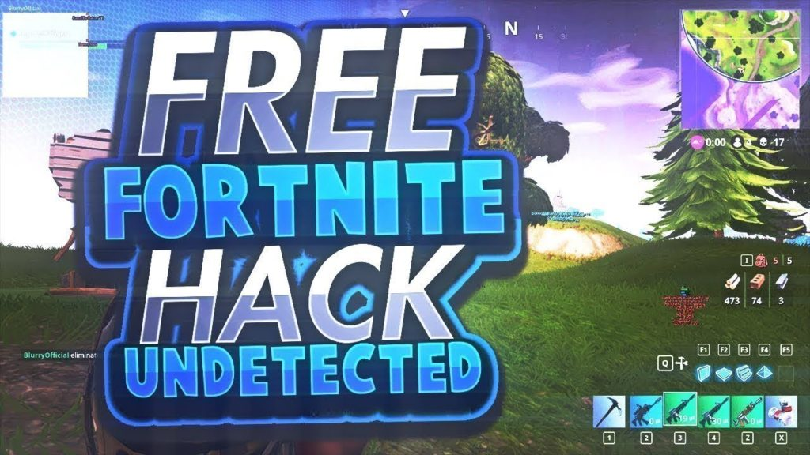

FortniteSangria -
    Completely open-source Fortnite hack, working with latest patch, developed by our team over holidays.
    Will continue to update the code every week.

Features :
    Fully functional ESP - Lines aligned to target hitbox allowing for easier auto-aim.
    Smooth auto-aim, you can alter the code to assign your own keybind for this. Default is `Mouse4`
    Anti-detection methods - multiple methods used making this virtually untraceable, even while being spectated.
    Easy silent-injection method - Manual mapping of the cheat into game memory. Undetectable.
    No need to disable PatchGuard! Unlike most major paid cheat providers, this cheat uses an advanced hooking mechanism to achieve it's goal.

Method :--
    Download the repo.
    Using Visual Studio 2019 open the solution and retarget to your Windows SDK, then rebuild. 
    If any issues arise, ensure you meet the correct dependencies.  
Or use the pre-compiled binary included in the bin\ folder.

You must run the executable whilst in an ACTUAL game that's -started- , not beforehand. Else you will crash.
Use the assigned key (F8) to open the menu and num-pad to control it. F2 is your panic button.

Important! -
AV's are likely to flag this as a False Positive, similar to Cheat Engine. Either create an exclusion or disable for the duration of the game.
DO NOT OVERUSE THIS CHEAT! While undetected, if you go around winning every single game with +50 kills somebody will take notice,
and your account might get flagged!

vJeko - 2019

credits to NSeven, TJ888, and UMO. 

this code is licensed under the GPLv3. for more information, read LICENSE.md.
